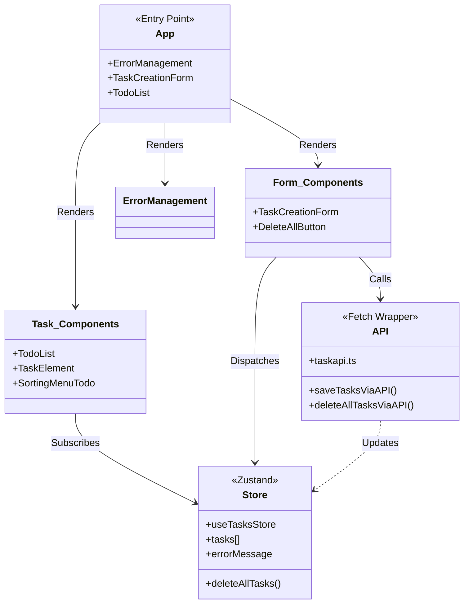
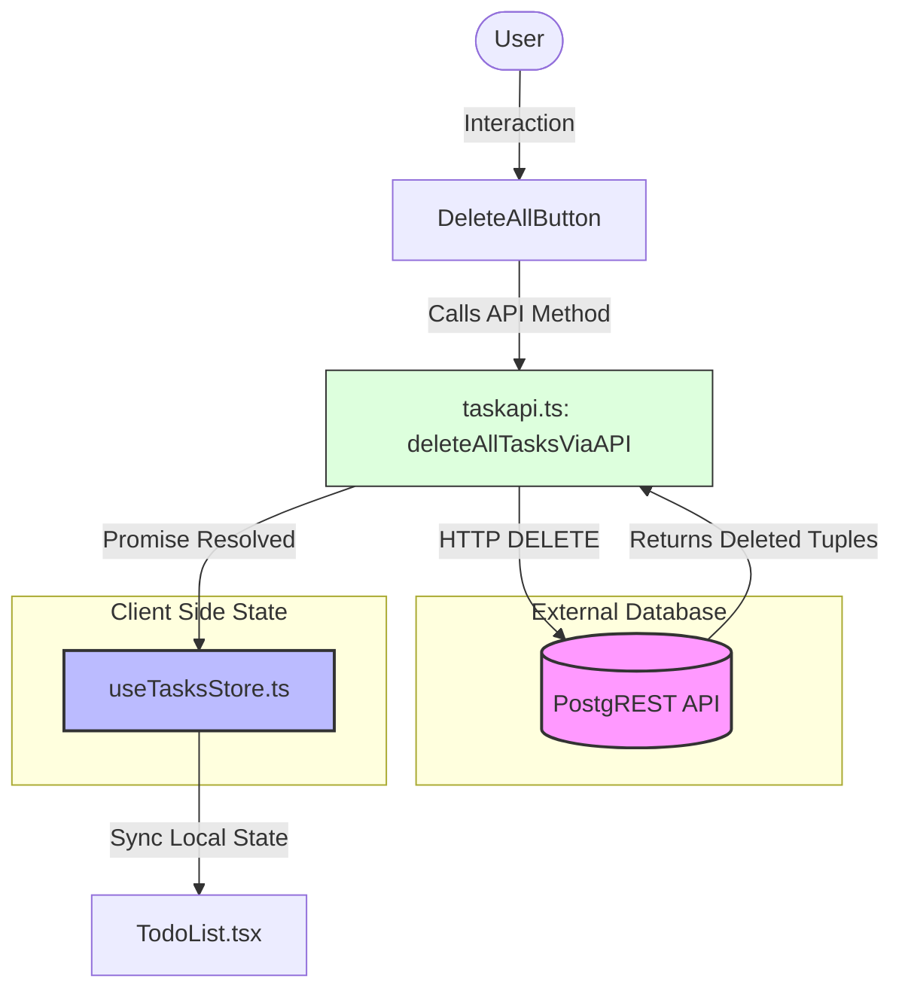

# TaskFlow Project

**by Thomas Lucking**

TaskFlow is a simple Todo application built with [Rsbuild](https://rsbuild.rs) and React. It allows users to create, view, and manage their tasks efficiently.

It uses Zustand for State Management and interacts with a PostgREST API for data persistence.

### Key Features

- **Full CRUD**: Create, Read, Update, and Delete tasks.
- **Global State**: Managed via Zustand for snappy UI updates.
- **Bulk Deletion**: Optimized "Delete All" functionality via PostgREST filters.
- **Error Handling**: Centralized error management system.
- **Sorting**: Built-in menu for organizing todos.

---

## Getting Started

### Prerequisites

Ensure you have `pnpm` installed on your system.

### Installation

Install the project dependencies:

```bash
pnpm install
```

### Development

Start the development server. The app will be available at [http://localhost:3000](http://localhost:3000):

```bash
pnpm run dev
```

### Production

Build the application for production:

```bash
pnpm run build
```

Preview the production build locally:

```bash
pnpm run preview
```

---

## Resources

To learn more about Rsbuild, explore the following resources:

- **[Rsbuild Documentation](https://rsbuild.rs)** - explore Rsbuild features and APIs
- **[Rsbuild GitHub Repository](https://github.com/web-infra-dev/rsbuild)** - feedback and contributions welcome

---

## Architecture Overview

### System Architecture



---

### Delete All Tasks Flow

---



---

<div align="center">
  <sub>Built with ❤️ using Rsbuild and React</sub>
</div>
